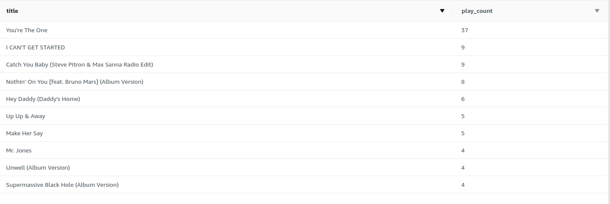
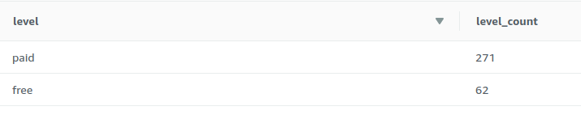
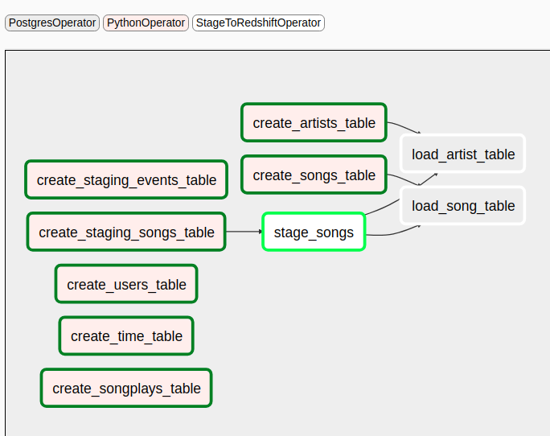
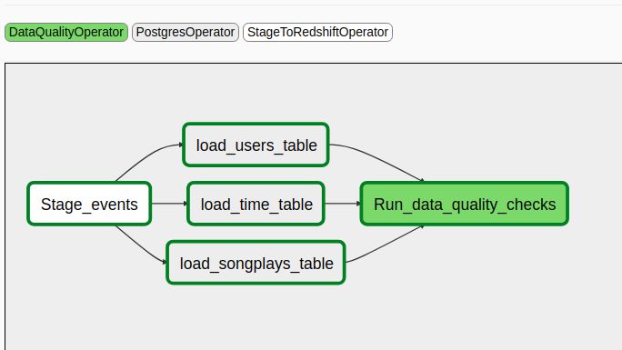
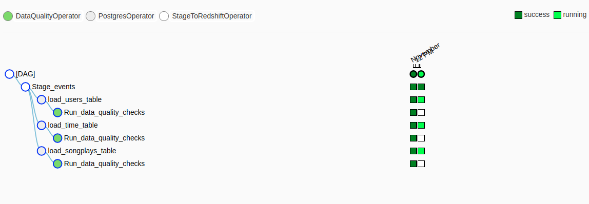
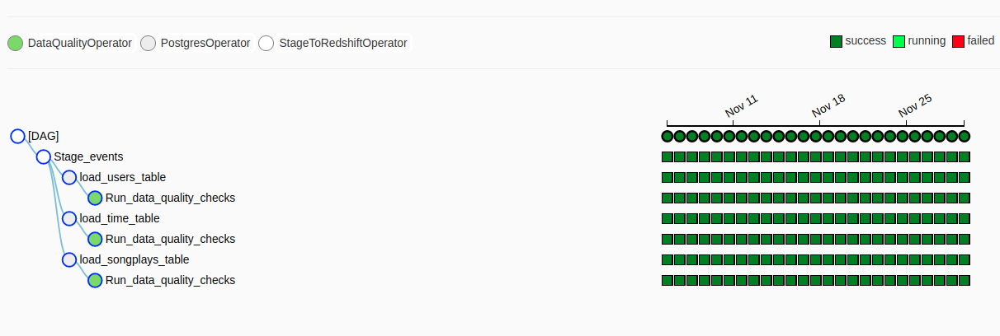
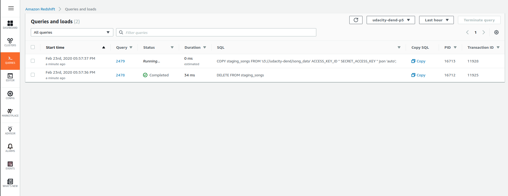

# Airflow for song play data engineering and analysis

This project takes log data from AWS S3 and loads it into a star-schema database for business analytics using Airflow.
The idea is we have data of customers using a music-playing app like Spotify, and want to improve our business/app through analytics.  The data is getting bigger, so we want to automate ingestion and analysis with Airflow, and use big data cloud tools including AWS's S3 and Redshift to store and process the data.

Note: I somewhat changed the approach and coding for this project.  Udacity's guidelines and rubric points don't make much sense in many cases (see "extra details" below).  I revised the DAGs as what I thought made much more sense.

# Sample results from the DB

Here are some ideas of what we might look at in the DB.  First, the top 10 songs played:

```sql
SELECT songs.title, COUNT(songs.title) as play_count
FROM songplays
JOIN songs
ON songplays.song_id = songs.song_id
GROUP BY songs.title
ORDER BY play_count DESC LIMIT 10;
```



Next, we might want to see how many paid and free users we have:

```sql
SELECT level, COUNT(level) level_count
FROM songplays
GROUP BY level
ORDER BY level_count DESC;
```



We could look at a lot more to optimize business and the app experience.  The fact table (songplays) has data on the user agent (e.g. phone, browser, etc), location, and time when the song was started.  Note that this data was simulated with an [event simulator](https://github.com/Interana/eventsim), but the song data is from the [million song dataset](http://millionsongdataset.com/).

# Running the project

Once you have Airflow and Redshift configured, you first enable and manually run the simply_create_all_tables DAG.  Then you enable the simply_sparkify_etl DAG and let it go.  Since the data only spans from 2018-11-1 to 2018-11-30, it has proper end and start dates.  In a real-world scenario, it would have a start date and no end date unless it was planning to be phased out.

The first DAG creates all Redshift tables, then also loads song/artist data into the songs staging table as well as songs and artists fact tables:



The second DAG creates the fact table (songplays) which has our main data of interest (which users -- paid/free -- played which songs and for how long) and creates users and time dimension tables:



While it's running, it looks like this:



When it's finished, it looks as so:



## Running Airflow
The first step is running Airflow.  The two best options I've come across thus far are:

- Google Cloud Composer
- M. Roisil's [docker images](https://github.com/puckel/docker-airflow)

See below for more details on running airflow locally with the docker container.  The file 'other_airflow_options' also discusses running Airflow on Udacity's workspaces and locally.

I took notes on some methods for running/debugging airflow code, and it's in the developing_airflow_code.md file.

## Running airflow locally with puckel's docker setup
The github repo with instructions is [here](https://github.com/puckel/docker-airflow).  I used the CeleryExecutor version which allows execution in parallel.

In the repo's config, the setting `dag_dir_list_interval` defaults to 300, or 5 minutes.  Change this to shorter like 30s or 60s which is more reasonable, or even 1s.

In the docker-compose-CeleryExecutor.yml file, uncomment the lines in the postgres container for persisting data (so you don't lose aws and redshift credentials upon any reboot or restart of the containers).  Also set the shared directories for dags, plugins, and the requirements.txt file which installs boto3 (used in the custom plugins).  Here is the code to get started once the yml and config files are ready:

`git clone https://github.com/puckel/docker-airflow.git`
`cd docker-airflow`

`docker-compose -f docker-compose-CeleryExecutor.yml up -d`

To run airflow CLI commands, it works as so:
`docker-compose -f docker-compose-CeleryExecutor.yml run --rm webserver airflow list_dags`

You can restart the docker cluster when you add a file to have it picked up right away:
`docker-compose -f docker-compose-CeleryExecutor.yml up -d`

Note the DAGs will be shown by their name as configured in the .py file, NOT the filename.

To stop the container cluster, you can run:
`docker-compose -f docker-compose-CeleryExecutor.yml down`

At first I was doing this, which would shutdown all containers with airflow in their description anywhere:
`docker stop $(docker ps | grep airflow | awk "{print \$1}")`

But then I discovered `docker-compose down` is much better.

## Creating Redshift cluster
The second step is to create the Redshift cluster.  I used 2 dc2.large nodes and set a user and password (leaving the default username, awsuser).  I also attached an IAM role which has S3 read access.  I left other settings as default.  Then you will need to make sure you can connect to the cluster from Airflow.  This means your VPC security group should allow inbound Redshift connections from the IP of your Airflow instance at least.  You also need to change the setting under security so that 'publicly accessible' is set to yes.

## Adding connections
We need to access our Redshift DB and S3.  We create connections under Admin->Connections.  This can also be done with the add_connections.py file.

S3 read access creds
- conn_id is 'amazon_web_services'
- Conn type is 'Amazon Web Services'
- login is the access key ID for a AWS IAM user with S3 read permissions (I also had redshift full access on the IAM but don't think it's necessary)
- password is the secret access key for the IAM user

Redshift DB access:
- conn id is 'redshift'
- Conn Type is 'Postgres'
- host is the cluster endpoint (without the port at the end), like `udacity-dend-p5.cvxtjfgdtfwc.us-west-2.redshift.amazonaws.com`.  Under 'properties' of the redshift cluster you should see this address; use it without the port or db name at the end
- schema is the DB name in redshift ('dev' by default)
- login is the db user ('awsuser' by default)
- password is any password you set for the awsuser DB user
- port is 5439 by default.

## Finally, running the DAGs

Now we can run our DAGs.  We visit the airflow UI (http://localhost:8080), and if our .py DAG files are in the right spot, we should see 'simply_create_all_tables' and 'simply_sparkify_etl' as DAGs.  First we turn on 'simply_create_all_tables' and manually run it.  Once that successfully completes, we can turn on simply_sparkify_etl, which will automatically start backfilling the data.

As the data is added to Redshift, you can watch it happening through the Redshift queries and loads tab:



Redshift has a nice feature where it gives an estimated run time.

## Extra details
### Problems with Udacity's project guidelines
There are several problems with Udacity's project guidelines.  For one, they suggest having retries with 5 minute delays.  This can be good once code is in production mode, but bad for testing and dev.  This leads students to starting the project with retries on, which makes debugging impossible.

Second, the songs data is static, so we only need to load it once.  Loading the songs data should be done in the create_all_tables DAG, and not loaded anew with each new day of songplay logs as Udacity specifies.  To load new song data, we could create folders with the day's date and add songs there.  Then we could have a task in our simply_sparkify_etl DAG which checks for any song folders with the execution_date and updates the songs table accordingly.  The songs data takes about 5 minutes to copy.  So not only are you unnecessarily using compute power, you're also going to be incurring huge S3 charges over time for repeatedly loading the same data over and over.  Not smart.  That's why I redesigned the DAGs to be more efficient.

The log data is daily frequency, but Udacity's specs call for hourly runs of the DAG.  This could make sense if you want to monitor hourly plays, but it doesn't match the frequency of the data and just doesn't seem realistic based on the dataset.

The architecture for the plugins is a bit gonzo.  Udacity mandates that the fact and dimension tables need separate operators, and should be parameterized.  However, fact/dimension tables don't seem easily extensible to me (i.e. not generalizable), so it would be better to just write SQL statements and use PostgresOperator() instead.  This would keep the code simpler and more organized rather than over-complicated.

### Setting default args in the DAG

The default_args dict in a DAG is passed to all operators in the DAG.  [BaseOperator](https://airflow.apache.org/docs/stable/_api/airflow/operators/index.html#airflow.operators.BaseOperator) shows most of the available options for this.  `catchup` is one arg we set to False in the [dag](https://airflow.apache.org/docs/stable/_api/airflow/models/dag/index.html#airflow.models.dag.DAG).
